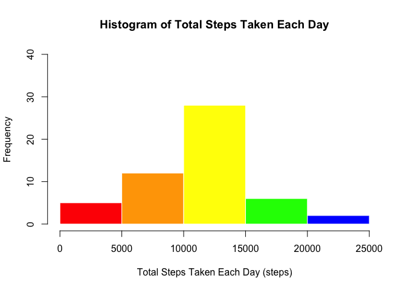
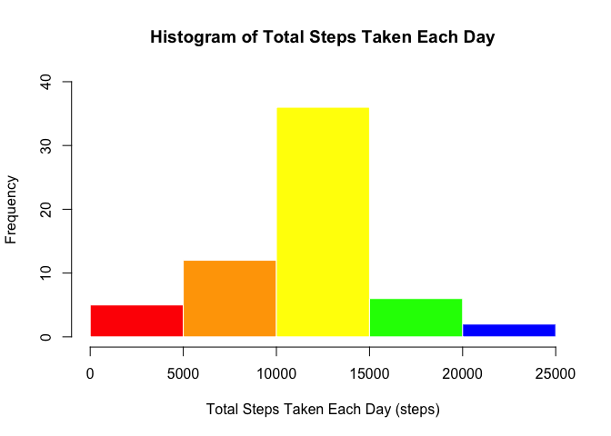
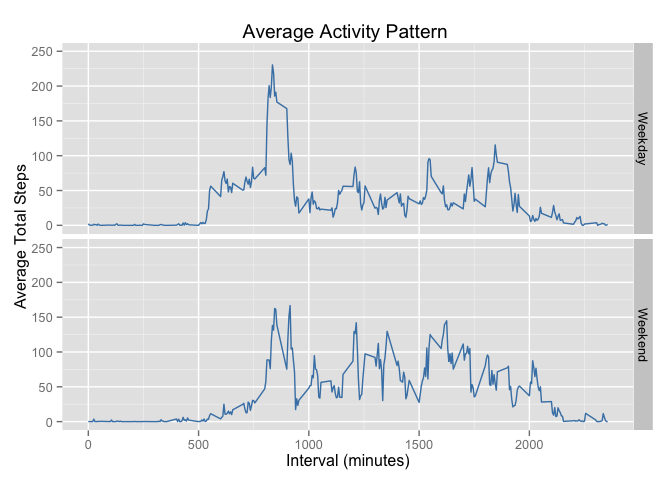

# Reproducible Research: Peer Assessment 1


## Loading and preprocessing the data

###Show any code that is needed to
###1.Load the data (i.e. read.csv())
###2.Process/transform the data (if necessary) into a format suitable for your analysis

First, create a directory to for this project.

```r
if (!file.exists("assessment1")){
        dir.create("assessment1")
}
```

Download and unzip the activity monitoring data.


```r
url<-"https://d396qusza40orc.cloudfront.net/repdata%2Fdata%2Factivity.zip"
download.file(url,destfile="./assessment1/activity.zip",method="curl")
unzip("./assessment1/activity.zip")
```

Load the activity monitoring data into R.


```r
data<-read.csv("activity.csv",na.strings = "NA", colClass = c("numeric","Date","numeric"))
```

## What is mean total number of steps taken per day?

For this part of the assignment, you can ignore the missing values in the dataset.
###1.Make a histogram of the total number of steps taken each day

To find out the mean total number of steps taken veryday, first create a new data frame "daysum" to store the total steps everyday.


```r
library(plyr)
daysum<-ddply(data,.(date),summarize,dailysum=sum(steps))
```

Make a histogram of the total number of steps taken each day.


```r
hist(daysum$dailysum, main ="Histogram of Total Steps Taken Each Day",xlab="Total Steps Taken Each Day (steps)",col=c("Red","Orange","Yellow","Green","Blue"),border="White",ylim=c(0,40))
```

 

###2.Calculate and report the mean and median total number of steps taken per day


```r
totalmean<-mean(daysum$dailysum,na.rm=TRUE)
totalmedian<-median(daysum$dailysum,na.rm=TRUE)
print(c("The mean of total steps taken per day is ", totalmean))
```

```
## [1] "The mean of total steps taken per day is "
## [2] "10766.1886792453"
```

```r
print(c("The median of total steps taken per day is ",totalmedian))
```

```
## [1] "The median of total steps taken per day is "
## [2] "10765"
```

## What is the average daily activity pattern?


###1.Make a time series plot (i.e. type = "l") of the 5-minute interval (x-axis) and the average number of steps taken, averaged across all days (y-axis)

To make a time series plot of average number of different intervals, first create a new data frame--"avg"" with the intervals and their average of steps across all times, and then plot the average over the intervals.


```r
avg<-ddply(data,.(interval),summarize,average=mean(steps,na.rm=TRUE))

plot(avg$interval, avg$average, type = "l",main="Average Daily Activity Pattern (NAs excluded)",xlab="Interval (minutes)",ylab="Average Total Steps")
```

 


###2.Which 5-minute interval, on average across all the days in the dataset, contains the maximum number of steps?


```r
for ( i in 1:nrow(avg)){
        if (avg$average[i]==max(avg$average)){
                maxint<-avg$interval[i]
        }
        
}
print(c("The interval with the maximum number of steps in the ", maxint,"-minute interval." ))
```

```
## [1] "The interval with the maximum number of steps in the "
## [2] "835"                                                  
## [3] "-minute interval."
```
From the new data frame avg, we can find that when the interval is 835, the average steps taken over all the time is the largest.

## Imputing missing values


Note that there are a number of days/intervals where there are missing values (coded as NA). The presence of missing days may introduce bias into some calculations or summaries of the data.

###1.Calculate and report the total number of missing values in the dataset (i.e. the total number of rows with NAs)

The following code calculate the number of missing values

```r
nasum<-sum(is.na(data))
print(c("There are", nasum, " missing values in this dataset."))
```

```
## [1] "There are"                        "2304"                            
## [3] " missing values in this dataset."
```
The number of NA values in this data set nasum is 2304 according to the following code.

###2.Devise a strategy for filling in all of the missing values in the dataset. The strategy does not need to be sophisticated. For example, you could use the mean/median for that day, or the mean for that 5-minute interval, etc.
###3.Create a new dataset that is equal to the original dataset but with the missing data filled in.

I answer the 2 questions above together. Here I replace the missin value in the dataset using correspondent average value in that interval.


```r
newdata<-data
for ( i in 1:nrow(newdata)){
        if (is.na(newdata$steps[i])==TRUE){
                for ( j in 1:nrow(avg)){
                        if ( newdata$interval[i]==avg$interval[j]){
                                newdata$steps[i]<-avg$average[j]                                
                        }
                        
                }
                
        }

}
```


###4.Make a histogram of the total number of steps taken each day and Calculate and report the mean and median total number of steps taken per day. Do these values differ from the estimates from the first part of the assignment? What is the impact of imputing missing data on the estimates of the total daily number of steps?

To make the required histogram, first create a dataset of the total steps taken per day.


```r
newdaysum<-ddply(newdata,.(date),summarize,dailysum=sum(steps))
```

Plot a histogram of total steps taken everyday and calculate the mean and median of total steps taken each day with the new data where the missing value of steps each day is replaced by the average value of that interval.


```r
hist(newdaysum$dailysum, main ="Histogram of Total Steps Taken Each Day",xlab="Total Steps Taken Each Day (steps)",col=c("Red","Orange","Yellow","Green","Blue"),border="White",ylim=c(0,40))
```

 


```r
newtotalmean<-mean(newdaysum$dailysum,na.rm=TRUE)
newtotalmedian<-median(newdaysum$dailysum,na.rm=TRUE)

print(c("After replacing the mising values, the mean of total steps taken per day is ",newtotalmean))
```

```
## [1] "After replacing the mising values, the mean of total steps taken per day is "
## [2] "10766.1886792453"
```

```r
print(c("After replacing the mising values, the median of total steps taken per day is ",newtotalmedian))
```

```
## [1] "After replacing the mising values, the median of total steps taken per day is "
## [2] "10766.1886792453"
```

The mean and median value from the data with and without NA value, newtotalmean and newtotalmedian does not differ much from the old mean and median value. The histogram generated from the dataset without NA values, compared to the one generated from, has a sharp increase in the 10000~15000 interval range, the interval range that has the highest frequency.

## Are there differences in activity patterns between weekdays and weekends?


For this part the weekdays() function may be of some help here. Use the dataset with the filled-in missing values for this part.

###1.Create a new factor variable in the dataset with two levels -- "weekday" and "weekend" indicating whether a given date is a weekday or weekend day.

Create a new factor variable in the dataset with two levels -- "weekday" and "weekend" indicating whether a given date is a weekday or weekend day.


```r
newdata$weekdays<-c()
for (i in 1:length(newdata$date)){
        if (weekdays(newdata$date[i]) %in% c("Monday","Tuesday","Wednesday","Thurday","Friday"))
                newdata$weekdays[i]<-"Weekday"
        if (weekdays(newdata$date[i]) %in% c("Sunday", "Saturday"))
                newdata$weekdays[i]<-"Weekend"        
}

newdata$weekdays<-as.factor(newdata$weekdays)
```
=============

###2.Make a panel plot containing a time series plot (i.e. type = "l") of the 5-minute interval (x-axis) and the average number of steps taken, averaged across all weekday days or weekend days (y-axis). 

Create a new dataset where the average of steps taken on weekdays and weekends are calculated and plot the weekday and weekend average.


```r
library(ggplot2)

newavg<-ddply(newdata,.(interval,weekdays),summarize,average=mean(steps))

weekplot<-ggplot(newavg,aes(interval,average))
weekplot+geom_line(color="steelblue")+facet_grid(weekdays~.)+labs(title="Average Activity Pattern ")+ labs(x="Interval (minutes)") +labs(y="Average Total Steps")+ylim(0,250)
```

 
